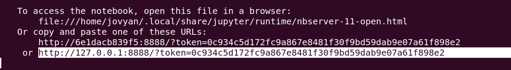
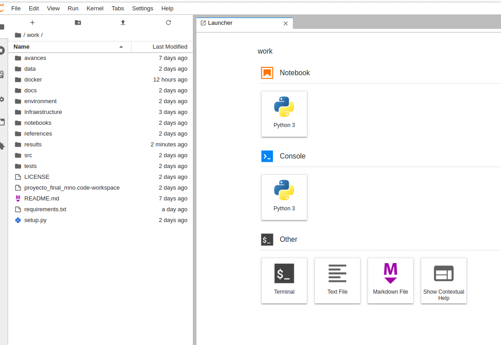
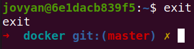

### Docker
**Notas para contenedor de docker:**   
Comando de docker para ejecución de la nota de forma local:  

nota: cambiar `<ruta a mi directorio donde se encuentra el repositorio>` por la ruta de directorio que se desea mapear a `/PCA-nutricion` dentro del contenedor
 de docker (para poder reproducir este proyecto, será necesario hacer git clone el repositorio de equipo y dirigirlo a la ubicación del mismo).
 
En nuestro caso, el repositorio se llama `pca-nutrientes`

**Copia y pega la siguiente linea en tu consola**
docker run --rm -it \                                      
-v `<ruta a mi directorio donde se encuentra el repositorio>`:/home/jovyan/work  \
-p 8888:8888 \
--entrypoint "/bin/bash" \
rafaelortega123972/mno_final_proj:v2

**En nuestro caso, se realizó de la siguiente manera**
docker run --rm -it \                                      
-v /home/rafaelortega/Documentos/pca-nutrientes:/home/jovyan/work  \
-p 8888:8888 \
--entrypoint "/bin/bash" \
rafaelortega123972/mno_final_proj:v2

Este comando te llevará a la consola de docker directamente como el user _jovyan_  

una vez en la consola, escribe el comando `jupyter lab` y te aparecerá lo siguiente:

   

Deberás selecionar el texto que aparece resaltado y copiarlo en un navegador. después de esto, copia la cadena que viene después del token y esa será la contraseña de la primera vez para acceder al notebook.

en nuestro caso:

password para jupyterlab: `0c934c5d172fc9a867e8481f30f9bd59dab9e07a61f898e2`  

Entra a la carpeta `work` y listo, tendrás acceso al repositorio en un ambiente de jupyter lab, donde podrás ejecutar el notebook que necesites.

   

Detener el contenedor de docker: 

salir del contenedor usando el comando `exit` 

  

y usar el siguiente comando para detener el contenedor.

`docker stop rafaelortega123972/mno_final_proj:v2` 
